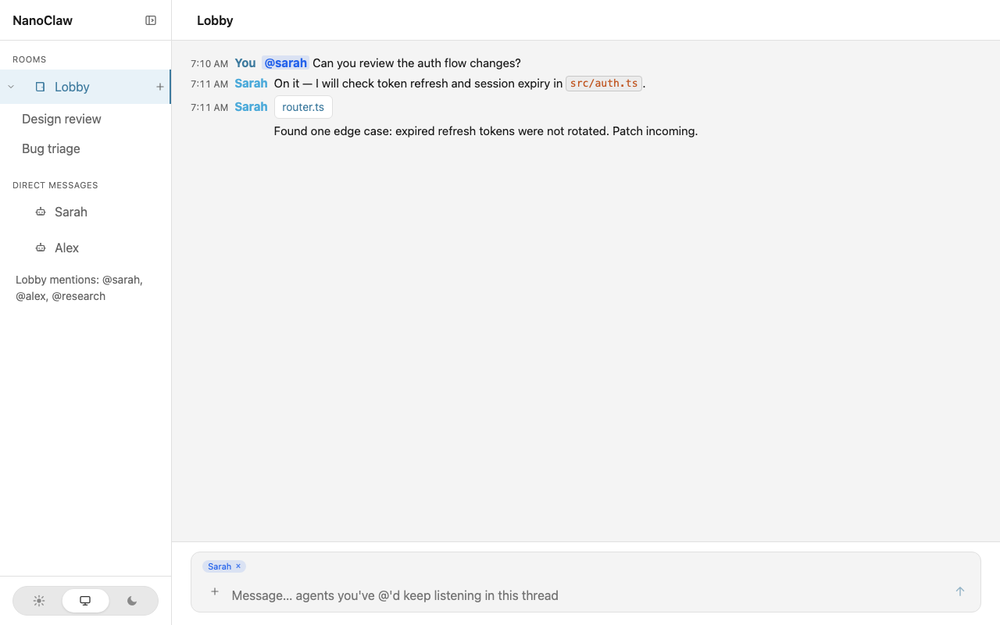
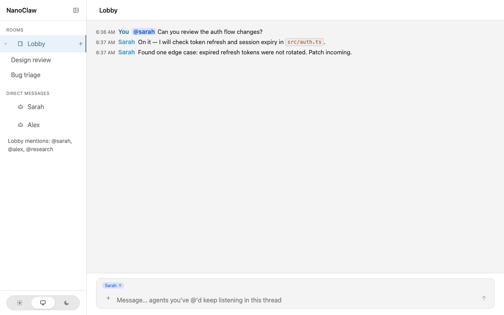
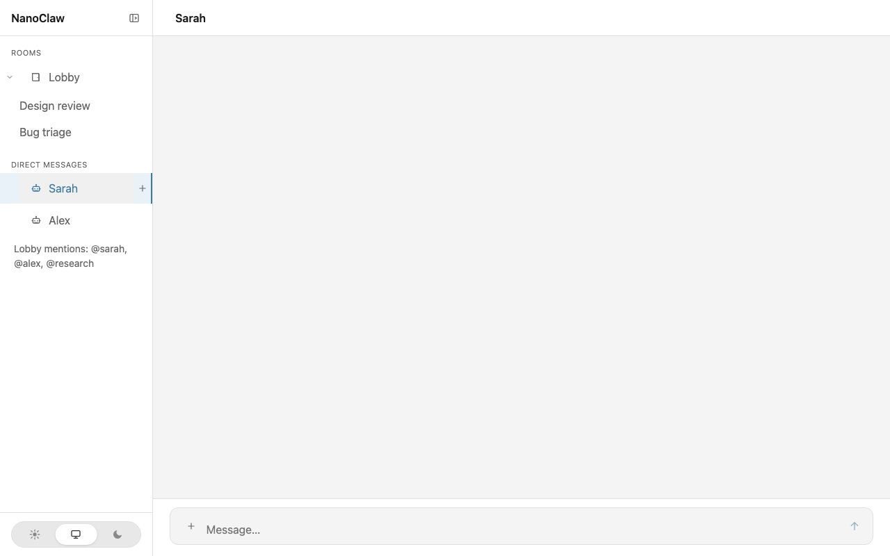
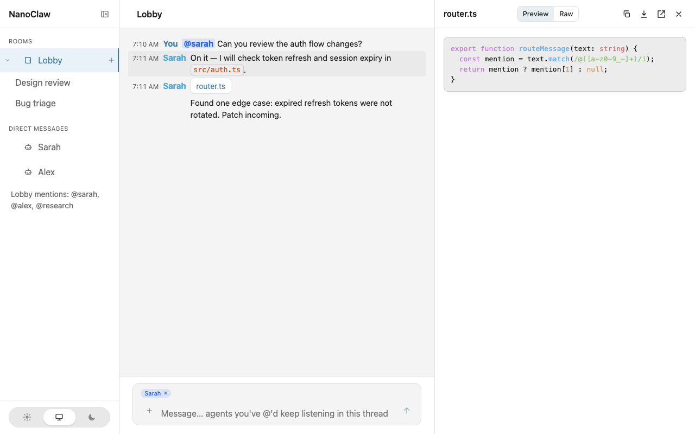

# nanoclaw-webchat

[](https://github.com/Artificer-Innovations/nanoclaw-webchat/actions/workflows/ci.yml)
[](https://www.npmjs.com/package/nanoclaw-webchat)
[](./LICENSE)

**Talk to your NanoClaw agents from a local browser tab** — lobby `@mentions`, per-agent DMs, threading, attachments, and an optional MCP server for Cursor.

**→ [Get started — QUICKSTART.md](./QUICKSTART.md)**

Prerequisites: **Node.js 22 LTS**, pnpm, and a working NanoClaw fork. See [QUICKSTART.md](./QUICKSTART.md#prerequisites).

```bash
pnpm add nanoclaw-webchat ws
pnpm exec nanoclaw-webchat install
# rebuild and restart your NanoClaw host, then open http://127.0.0.1:3200
```

## Why this exists

NanoClaw runs multiple AI agents with real tooling and persistent workspaces. You need a **local-first chat desk** to reach them — not Slack, not a hosted SaaS widget, and not another standalone agent runtime.

nanoclaw-webchat is an **opinionated channel add-on** for an existing NanoClaw fork:

- **Localhost-only** — default binds to `127.0.0.1`, secret injected by the host
- **Optional public auth** — cookie sessions, login page, GitHub/OIDC, shared-password login for network deployments ([setup guide](./docs/public-auth.md))
- **Multi-agent lobby** — `@sarah`-style routing with **engaged agents** that keep listening after a mention
- **Per-agent DMs** — direct 1:1 rooms when you don't want a shared lobby
- **Threading** — multiple conversation threads per room, persisted in SQLite
- **Same delivery path** — messages flow through NanoClaw's normal router, not a side channel

This package ships the browser UI, channel adapter templates, install skill, CLI, and MCP server. **You still need a working NanoClaw fork** — this is not NanoClaw itself.

## Screenshots

| Lobby with `@mentions` and engaged agents | Sidebar: rooms, DMs, threads |
|---|---|
|  |  |

| Direct message | Attachment preview drawer |
|---|---|
|  |  |

## Features

| Area | Details |
|------|---------|
| **Lobby** | Shared room; route to agents with `@folder` mentions; engaged-agent chips stay active until dismissed |
| **DMs** | One room per agent (`dm:<folder>`) |
| **Threads** | Create, rename, delete threads per room; unread badges in the sidebar |
| **Messages** | Markdown (GFM), code blocks, `@mention` highlighting |
| **Attachments** | Drag-and-drop files; resizable preview drawer (images, PDF, code, CSV, markdown) |
| **Theme** | Light / dark / system |
| **Persistence** | History in host `data/webchat.db` |
| **CLI** | `install`, `upgrade`, `sync-skill`, `verify`, `uninstall` |
| **Auth** | Local token (default) or public mode: basic login, OIDC/OAuth (e.g. GitHub), per-user rooms |
| **MCP** | Bundled `nanoclaw-webchat-mcp` bin — list channels, read/send messages from Cursor |
| **Skill** | `/add-webchat` Claude Code install flow |

## Quick install

Requires Node.js ≥ 20, pnpm, and a **running NanoClaw fork**.

```bash
cd /path/to/your-nanoclaw-fork
pnpm add nanoclaw-webchat ws
pnpm exec nanoclaw-webchat sync-skill
/add-webchat    # in Claude Code, or: pnpm exec nanoclaw-webchat install
pnpm run build && restart host
open http://127.0.0.1:3200
```

Full walkthrough: **[QUICKSTART.md](./QUICKSTART.md)**

## Configuration

### Local mode (default)

| Variable | Required | Default | Description |
|----------|----------|---------|-------------|
| `WEBCHAT_ENABLED` | yes | — | Set `true` to start the channel |
| `WEBCHAT_PORT` | no | `3200` | HTTP/WebSocket port |
| `WEBCHAT_PUBLIC_PATH` | no | — | Public URL path prefix (e.g. `/webchat`) when a reverse proxy strips that prefix before the adapter; rewrites `/api` and `/assets` in served HTML/JS so the browser stays on the mount. Do not set this to `/api` or `/assets`. |
| `WEBCHAT_SECRET` | yes | — | Bearer token (injected into served HTML in local mode) |
| `WEBCHAT_USER_ID` | no | `web:local` | User id for outbound messages |
| `WEBCHAT_DISPLAY_NAME` | no | `Local` | Display name in the UI |
| `WEBCHAT_TEAM_FOLDER` | no | — | Agent folder for `@team` mentions |

### Public auth mode

Set `WEBCHAT_AUTH_MODE=public` for login-protected deployments (VPN, tailnet, or internet with HTTPS). Requires `WEBCHAT_SESSION_SECRET` plus basic and/or OIDC configuration.

**→ [Public authentication setup guide](./docs/public-auth.md)** — env vars, GitHub OAuth, allowlists, production checklist.

See [QUICKSTART.md](./QUICKSTART.md) and [api-contract.md](./api-contract.md) for install steps and the REST/WebSocket API.

## Architecture

```
Browser UI  ←HTTP/WS→  web.ts adapter (in your fork)  →  NanoClaw router  →  agents
MCP server  ←REST──→  same adapter
```

```
packages/client   →  React SPA (dist/client/)
packages/adapter  →  channel adapter templates → copied into host src/
packages/cli      →  nanoclaw-webchat bin
packages/mcp      →  nanoclaw-webchat-mcp bin (bundled)
packages/shared   →  shared types (internal)
skills/add-webchat → /add-webchat install skill
```

## Security

Two authentication models are supported:

| Mode | Use case | Summary |
|------|----------|---------|
| **Local** (default) | Single operator on the same machine | Binds to `127.0.0.1`; `WEBCHAT_SECRET` embedded in served HTML |
| **Public** | Multiple users over a network | Login page, session cookies, optional OIDC/GitHub or shared password; see [docs/public-auth.md](./docs/public-auth.md) |

Do not bind to `0.0.0.0` or expose the port on the internet without enabling **public auth**, TLS, and an allowlist. Details: [SECURITY.md](./SECURITY.md).

## Development

```bash
pnpm install
pnpm run typecheck
pnpm run test:coverage
pnpm run build
pnpm --filter @nanoclaw-webchat/client dev   # Vite → proxies /api to :3200
```

Test against a local NanoClaw fork without publishing:

```bash
cd ../your-nanoclaw-fork
pnpm add file:../nanoclaw-webchat
pnpm exec nanoclaw-webchat install
```

See [CONTRIBUTING.md](./CONTRIBUTING.md) for branch flow, changesets, and monorepo layout.

## Branches & releases

| Branch | Role |
|--------|------|
| **`develop`** | Integration — feature and fix PRs land here |
| **`main`** | Release — merging `develop` → `main` publishes to npm and creates a GitHub Release |

Versioning uses [Changesets](https://github.com/changesets/changesets). Release notes: [CHANGELOG.md](./CHANGELOG.md)

## License

MIT — Copyright (c) 2026 [Artificer Innovations, LLC](https://github.com/Artificer-Innovations)

See [LICENSE](./LICENSE).
