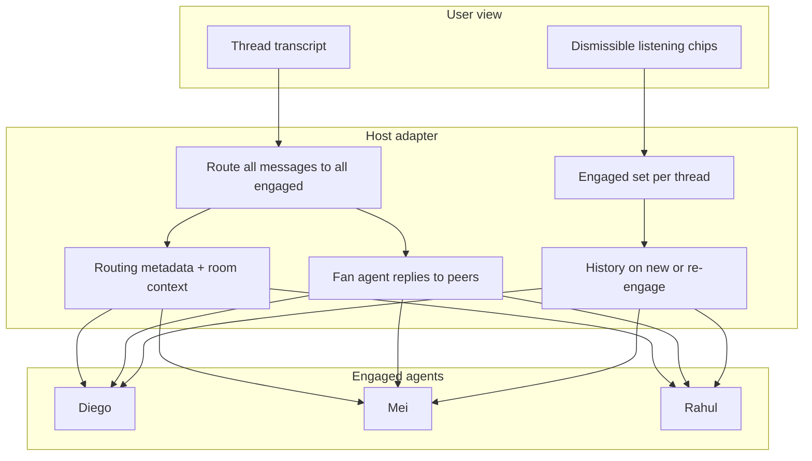

# Feature brief: engaged agents in lobby threads

## Summary

In the web chat **lobby**, users currently must `@mention` an agent in every message for that agent to respond. **Engaged agents** fixes this: once an agent has been `@`'d in a thread, they **stay engaged** and continue receiving messages without being `@`'d again.

The feature evolves lobby threads from isolated user↔agent pairs into a **shared room** — multiple agents can listen, see each other's replies, and know when a message is meant for them vs someone else.

This applies to lobby and lobby child threads only. **DM rooms are unchanged** — every message already goes to that room's agent.

---

## Problem

Lobby routing is mention-only today. A typical conversation:

1. User: `@sarah review this PR`
2. Sarah replies
3. User: `thanks, any blockers?` → **no response** (Sarah was not @'d again)

That forces repetitive `@sarah` on every turn. Multi-agent threads make it worse: agents can't see each other's replies, newly added agents start with no context, and there's no way to remove one agent without deleting the thread.

---

## Mental model

A lobby thread with engaged agents is a **shared room**:

- Same participants see the same conversation (user + all engaged agents).
- Each message has clear **audience metadata** — broadcast vs **explicit** `@` mention vs **implicit** name reference.
- Agents **not** targeted on a directed message still receive it but should **defer**.
- Users can ask an agent to leave (×) without ending the thread.



---

## Goals

1. **Reduce mention fatigue** — after inviting an agent into a thread, continue the conversation normally.
2. **Shared room coherence** — all engaged agents receive all messages (user + peer agent replies).
3. **Intentional targeting** — explicit `@` and implicit name references signal who should respond; others defer.
4. **Context on join** — newly or re-`@`'d agents get recent thread history, not a cold start.
5. **Visible engagement** — UI shows who is listening; users can remove agents with ×.
6. **Persist across restarts** — engaged state lives in the host database, scoped per thread.

---

## Scope and non-goals

**In scope**

- Lobby and lobby child threads (`platformId: lobby`, any `threadId`).
- Per-thread engaged set stored in `webchat.db`.
- UI listening chips with per-agent dismiss (×).
- Agent-side routing metadata, peer fan-out, and history backfill.

**Out of scope**

- **Cross-thread memory** — engaging `@sarah` in thread A does not engage her in thread B.
- **DM behavior changes** — DMs continue to route every message via `platformId`.
- **Client-side mention injection** — UI sends user text as typed; routing is server-side.
- **Auto-disengage on timeout** — optional future enhancement (P2).

---

## Routing and engagement rules

### Engaged set

| Event | Engaged set |
|-------|-------------|
| First message in thread, no `@` | Unchanged (empty); no agents receive |
| Message contains `@agent` | Add mentioned folder(s) to engaged set |
| User removes agent via × | Remove that folder from engaged set |
| User `@`s agent again after removal | Re-add to engaged set (+ backfill) |
| Thread deleted | Engaged set cleared |

Valid mentions match agent **folders** (e.g. `@sarah`) or `@team` when `WEBCHAT_TEAM_FOLDER` is set. `@here` and unknown handles are ignored. Matching is case-insensitive.

### Message delivery

**All currently engaged agents always receive all messages** — user posts and agent peer replies. The engaged set is evaluated at delivery time; there is no “only agents engaged before this message” window.

| User message type | `explicitMentions` | `implicitMentions` | Who receives | `responseExpectation` (per receiver) |
|-------------------|-------------------|---------------------|--------------|--------------------------------------|
| Broadcast | `[]` | `[]` | All engaged | `"defer"` for all — use judgment; any may reply if useful |
| `@rahul …` | `["rahul"]` | `[]` | All engaged | Rahul: `"expected"`; others: `"defer"` |
| `Rahul — did you see…` | `[]` | `["rahul"]` | All engaged | Rahul: `"lean"`; others: `"defer"` |
| `@rahul @diego …` | `["rahul", "diego"]` | `[]` | All engaged | Rahul & Diego: `"expected"`; others: `"defer"` |
| `@rahul hey Diego …` | `["rahul"]` | `["diego"]` | All engaged | Rahul: `"expected"`; Diego: `"lean"`; others: `"defer"` |
| Agent peer reply | `[]` | `[]` | Other engaged | All: `"defer"` + `isPeerReply: true` |

**Explicit mentions** — `@folder` tokens parsed from message text (same rules as engagement: valid agent folders, `@team`, case-insensitive). These also add agents to the engaged set when not already engaged.

**Implicit mentions** — name references to **engaged** agents without `@`. See [Implicit mention detection](#implicit-mention-detection) below. Implicit mentions do **not** add new agents to the engaged set — only `@` does.

**Agent peer replies:** when any engaged agent replies, that reply is delivered to **all other engaged agents** (and shown once in the user UI as today). Peer deliveries carry `isPeerReply: true` and `responseExpectation: "defer"` — context only; **no reply expected**. This prevents reply cascades when multiple agents are engaged on a broadcast.

**Peer fan-out ordering:** fan-out is **async** relative to the user seeing the reply in the UI. The user may see Diego's response before Rahul receives the peer copy.

**Peer fan-out delivery (v1):** **best-effort** — the host attempts delivery to all other engaged agents but does not block the user thread or retry indefinitely on failure. There is no automatic catch-up for continuously engaged agents who miss a delayed or dropped peer copy (backfill only runs on re-engage). Agents should tolerate brief ordering gaps; duplicate or conflicting replies on a broadcast are an accepted v1 risk. P2 may add a short fan-out window or stronger delivery guarantees if this proves painful in practice.

**Disengaged agents** do not receive messages delivered after removal. **Re-engaged agents** receive a context backfill before live traffic resumes (see [Backfill sequencing](#backfill-sequencing)).

Engaged agents persist in SQLite per `(platformId, threadId)` and survive host restarts. Rows accumulate for threads that are never explicitly deleted; **TTL / auto-disengage is deferred to P2** (see [Later considerations](#later-considerations-p2)) — not forgotten, but not blocking phase 1–2.

### Implicit mention detection

Match against each **engaged** agent's folder and display name. Detection is **position-gated** — a whole-word name match alone is not sufficient; the name must appear in an address-like position.

Rules:

1. **Whole-word only** — word-boundary match (`\bmei\b`), not substring. `email`, `premier`, and `overhauling` must **not** match `mei` or `rahul`.
2. **Case-insensitive.**
3. **Address positions only** — name at sentence start, after `,`, after `hey` / `ok` / similar vocatives, or immediately before `—` / `:` / `,`. Examples: `Rahul — …`, `hey Diego`, `Mei, thoughts?`
4. **Exclude citations** — in-passing references do **not** match. Patterns like `as Rahul said`, `Rahul mentioned`, `per Diego's note` are citations, not addresses. Users citing an agent should `@` them if they want a response.
5. **Exclude code and quotes** — do not match inside fenced code blocks, inline `` `code` ``, or quoted spans (`"…"`, `'…'`).

**Complexity note:** word-boundary matching across natural language has edge cases (hyphenated names, non-ASCII text, name collisions). Phase 2 ships this parser; phase 1 does not need it. If real usage shows users prefer `@` over name-only addressing, we can simplify later — but explicit `@` + broadcast already covers the core mention-fatigue problem in phase 1.

| Text | `implicitMentions` |
|------|-------------------|
| `Rahul — did you see the other replies?` | `["rahul"]` |
| `hey Diego, can you check?` | `["diego"]` |
| `overhauling the auth module` | `[]` |
| `as Rahul said earlier` | `[]` (citation, not address) |
| `` `rahul` config updated `` | `[]` (inside inline code) |

### Routing metadata

Each delivery to an engaged agent is a **separate payload** — routing fields are computed **per receiver**, not shared across agents. The same user message produces different `responseExpectation` values for Rahul vs Diego vs Mei.

Shared fields (same on every copy): `explicitMentions`, `implicitMentions`, `engagedAgents`, `isPeerReply`.

Per-receiver fields (vary by who is receiving): `responseExpectation`.

**`responseExpectation`** — three-state routing signal, computed per receiver. Agents use this as guidance, not a hard command — they always retain judgment on whether to produce a reply.

| Value | Meaning |
|-------|---------|
| `"expected"` | Receiver was explicitly `@`'d — **respond when you have something useful to say**. Silence is fine when there is genuinely nothing to add; the signal means you are the intended audience, not that you must always produce content. |
| `"lean"` | Receiver was implicitly mentioned by name — **lean toward responding if appropriate in context**; no hard obligation. |
| `"defer"` | Context-dependent (see below). |

**`"defer"` has two readings** depending on message type:

| Context | `"defer"` means |
|---------|-----------------|
| **Broadcast** (no mentions) | Use judgment — any engaged agent may reply if useful |
| **Targeted at others** (explicit or implicit) | Stay quiet unless you have essential context to add |
| **Peer reply** (`isPeerReply: true`) | Context only — do not reply |

**Implicit mention** — same message, two receivers:

```json
// Delivered to Rahul
{
  "text": "Rahul — did you see the other replies?",
  "routing": {
    "explicitMentions": [],
    "implicitMentions": ["rahul"],
    "engagedAgents": ["diego", "mei", "rahul"],
    "responseExpectation": "lean",
    "isPeerReply": false
  }
}

// Delivered to Diego (same user message, different metadata)
{
  "text": "Rahul — did you see the other replies?",
  "routing": {
    "explicitMentions": [],
    "implicitMentions": ["rahul"],
    "engagedAgents": ["diego", "mei", "rahul"],
    "responseExpectation": "defer",
    "isPeerReply": false
  }
}
```

**Explicit mention** — delivered to Rahul:

```json
{
  "text": "@rahul did you see the other replies?",
  "routing": {
    "explicitMentions": ["rahul"],
    "implicitMentions": [],
    "engagedAgents": ["diego", "mei", "rahul"],
    "responseExpectation": "expected",
    "isPeerReply": false
  }
}
```

**Peer reply** — Diego's reply, delivered to Rahul:

```json
{
  "text": "LGTM on structure, one nit on error handling.",
  "senderName": "diego",
  "routing": {
    "explicitMentions": [],
    "implicitMentions": [],
    "engagedAgents": ["diego", "mei", "rahul"],
    "responseExpectation": "defer",
    "isPeerReply": true
  }
}
```

### Room-context stub

When an agent **joins or re-joins** the engaged set, inject a one-time room-context stub:

> You are engaged in this lobby thread. Other agents currently listening: Diego, Mei. You receive the same user messages and other agents' replies in this thread.

**When the engaged set changes for agents already in the room** (e.g. Rahul is added while Mei is already engaged):

- **New joiner** — receives stub + backfill on (re)engage (normal path).
- **Existing peers** — **silent state update**: `engagedAgents` in subsequent routing metadata reflects the new set. Do **not** inject an immediate system message into busy sessions.
- **Optional refresh stub** — prepended to the **next live message delivery** to existing peers only if the roster change is material (agent added or removed). One line max: *"Rahul has joined this thread."* Omit on × removal (peers infer from metadata).

This avoids noisy system-message spam while keeping roster awareness current.

### Multi-agent example

```
User:  @sarah can you review?
       → Sarah added to engaged set; receives message + backfill (if new)
Sarah: (responds — all engaged agents see this reply)

User:  @diego can you check the tests?
       → Diego added; Sarah still engaged; both receive
       → Diego expected to respond; Sarah defers
Diego: (responds — Sarah and Diego both see it)

User:  looks good to merge — any concerns?
       → both receive (broadcast; explicitMentions=[], implicitMentions=[])
       → either may respond

User:  Diego — your call on the merge
       → both receive; Diego implicitly mentioned; Sarah defers

User:  @diego your call on the merge
       → both receive; Diego explicitly @'d; Sarah defers aggressively

User:  [removes Sarah via ×]
       → Sarah stops receiving; Diego stays engaged
```

---

## User experience

### Listening indicator

When agents are engaged, show **individual dismissible chips** above the composer:

> `[diego ×] [mei ×] [rahul ×]`

Earlier iterations used a single pill (*“diego, mei, rahul are listening”*); chips with × are the target UX.

| Interaction | Behavior |
|-------------|----------|
| **Remove (×)** | Agent removed from engaged set; chip disappears (silent — no system message in thread). **Known gap:** removed agent receives no disengage signal; messages simply stop. Acceptable for v1; optional one-line stub in P2. |
| **Re-@mention** | Agent re-engaged; chip returns; backfill delivered |
| **Thread delete** | All agents cleared |

**UX details:** show × on hover (desktop); tap-to-reveal on mobile. Optional undo toast on accidental removal. × hit target ≥ 44px on touch. Removal affects **future routing only**.

### Composer placeholder

- Engaged: *“Message… agents you've @'d keep listening in this thread”*
- Not engaged: *“Message… use @folder to reach an agent”*

### Message display

- User messages shown **as typed** — no silent `@` prefixes in the UI.
- Agent replies use `senderName` from the host when available.

### Multi-tab sync

When the engaged set changes, all browser tabs update via WebSocket `engaged` event.

---

## Agent experience

### History backfill on (re)engage

When an agent is **newly `@`'d or re-`@`'d** (first in thread, after × removal, or after falling out of engaged state):

1. Deliver a **context preamble** with the live message that triggered (re)engagement.
2. Include the **last N messages** from the thread (user + agent replies), with **full attachment data** (`data` / `url`) — not text-only. Default **N = 20**, configurable per deployment (e.g. `WEBCHAT_BACKFILL_MESSAGE_LIMIT`).
3. Frame as catch-up: *“You've been added to this thread. Here's recent context:”*
4. **Once per engagement cycle** — agents already engaged do not get repeated backfill on every message.

For threads with fewer than N messages, include all available history.

**Backfill payload size:** full attachments on up to N messages can be large in image-heavy threads. Accept for v1; monitor in P2 and add size budgets or attachment summarization if needed.

**Backfill speaker labels** — use `[User]` or the user's display name, never `You` (which reads as the receiving agent in Mei's session). Agent lines use folder or display name.

**Example** (backfill delivered to Mei):

```
[System] You've been added to lobby thread "Review PR #42".
Other agents listening: Diego.
Recent messages:
  [User]: @diego can you review the diff?
  Diego: LGTM on structure, one nit on error handling...
  [User]: @mei can you weigh in on testing?
--- end context ---
[User]: @mei can you weigh in on testing?   ← live message
```

### Backfill sequencing

On re-engage, the host **must complete backfill delivery before routing any live messages** to that agent for that engagement cycle. If a second user message arrives while backfill is being assembled, it **queues behind** the backfill — no race. Applies per agent independently (Mei's backfill does not block Diego's live traffic).

### Response judgment

Agents act on **`responseExpectation`** as routing guidance — not as a mandate to reply or stay silent in every case.

| `responseExpectation` | Agent behavior |
|-----------------------|----------------|
| `"expected"` | You were explicitly `@`'d — respond when you have something useful; silence is OK when there is nothing to add |
| `"lean"` | You were named without `@` — lean toward responding if appropriate in context; no hard obligation |
| `"defer"` (broadcast) | Use judgment — reply if you have something useful |
| `"defer"` (targeted at others) | Stay quiet unless essential context to add |
| `"defer"` (peer reply) | Context only — do not reply (`isPeerReply: true`) |

---

## API surface (additive)

### `GET /api/rooms/:platformId/threads/:threadId/messages`

```json
{
  "messages": [ /* unchanged */ ],
  "engagedAgents": ["sarah", "diego"]
}
```

`engagedAgents`: agent **folder** strings, ordered by first engagement. `[]` when none.

### WebSocket `engaged` event

```json
{
  "type": "engaged",
  "platformId": "lobby",
  "threadId": "thread_abc",
  "agents": ["sarah", "diego"]
}
```

Emitted when the engaged set changes (`@` mention adds agent, or × removes agent).

### `POST .../messages`

No body change. User text is unchanged.

### `DELETE .../engaged/:agentFolder`

Removes one agent from the thread engaged set. Response:

```json
{ "agents": ["diego"] }
```

Host broadcasts the `engaged` WebSocket event with the updated list.

---

## Success criteria

### Core engagement

- [ ] `@sarah` once, then a no-`@` follow-up, produces a response from Sarah.
- [ ] Two agents `@`'d at different times both receive subsequent no-`@` broadcasts.
- [ ] Engaged state survives host restart (`engagedAgents` in GET response).
- [ ] Deleting a thread clears engaged state.
- [ ] DM rooms behave exactly as before.

### Shared room

- [ ] All engaged agents receive every user message, including `@`-targeted ones.
- [ ] Agent A's reply appears in Agent B's session when both are engaged.
- [ ] Routing metadata is computed **per receiver** with `responseExpectation` (`"expected"` | `"lean"` | `"defer"`).
- [ ] In-passing citations do not trigger implicit mentions (`as Rahul said` → `[]`).
- [ ] Implicit detection uses word-boundary matching; no false positives on substrings (`email` ≠ `mei`).
- [ ] Peer replies carry `isPeerReply: true` and do not trigger reply cascades.
- [ ] Backfill completes before live messages on re-engage (no race).

### Context and UI

- [ ] Newly or re-`@`'d agent receives backfill (default 20 messages, configurable) with full attachment data.
- [ ] Continuously engaged agents do not receive repeated backfill.
- [ ] UI shows dismissible listening chips; × removes one agent without deleting thread.
- [ ] Re-`@` after removal re-engages and restores chip.
- [ ] WS + GET stay in sync across tabs.

---

## Implementation phases

| Phase | Deliverable |
|-------|-------------|
| **1 — Foundation** | Engaged set in SQLite; no-`@` follow-ups route to engaged agents; `engagedAgents` on GET + WS. **Shippable on its own** — validates mention-fatigue fix before phase 2 complexity. |
| **2 — Shared room** | All messages to all engaged; peer fan-out with `isPeerReply` (best-effort); per-receiver routing metadata (`responseExpectation`, explicit + implicit mentions) |
| **3 — Context** | Backfill on new/re-engage (configurable message limit, full attachments); room-context stub |
| **4 — UI polish** | Dismissible × chips; placeholder copy; multi-tab sync |
| **5 — Later (P2)** | Summary for pre-20 history; engaged count in sidebar; inactivity timeout |

Host adapter ships before or with UI changes; older UI still benefits from server-side routing once phase 1–2 land.

---

## Later considerations (P2)

- **Summarized backfill** — optional summary of messages older than the backfill cap.
- **Backfill payload monitoring** — size budgets or attachment summarization if full-attachment backfill is too heavy.
- **Stronger peer fan-out** — delivery guarantees or short fan-out window before continuing live traffic.
- **Sidebar hints** — engaged agent count or avatars on thread list rows.
- **Auto-disengage / TTL** — clear stale engaged-set rows after inactivity (e.g. 24h). Addresses SQLite row accumulation for threads never explicitly deleted.
- **Disengage signal** — optional one-line stub to removed agent (*"You've been removed from this thread."*).

---

## Product decisions (reference)

| Topic | Decision |
|-------|----------|
| Explicit `@` + engaged peers | All engaged agents receive every message; non-mentioned agents bias toward not responding |
| Implicit vs explicit mentions | Separate `explicitMentions` (`@folder`) and `implicitMentions` (position-gated whole-word match, no `@`); only `@` adds to engaged set |
| Response signal | Per-receiver `responseExpectation`: `"expected"` (encourage reply when useful) \| `"lean"` (if appropriate in context) \| `"defer"` (judgment or stay quiet, by context) |
| In-passing references | Citations (`as Rahul said…`) do **not** match implicit mentions — address positions only |
| Peer fan-out delivery | **Best-effort** in v1; no automatic catch-up for missed peer copies |
| Peer replies | `isPeerReply: true`, always `"defer"` — context only, no cascade |
| Room-context refresh | Silent metadata update for existing peers; optional one-line stub on next delivery, not immediate spam |
| Backfill ordering | Backfill completes before live traffic per re-engagement cycle |
| Fan-out scope | All engaged agents always receive all messages; no temporal cutoff |
| History on (re)engage | Last **N messages** (default 20, configurable), **full attachment data**, on new or re-`@` only |
| Disengage | **UI only** — × chips; no standalone public API |
